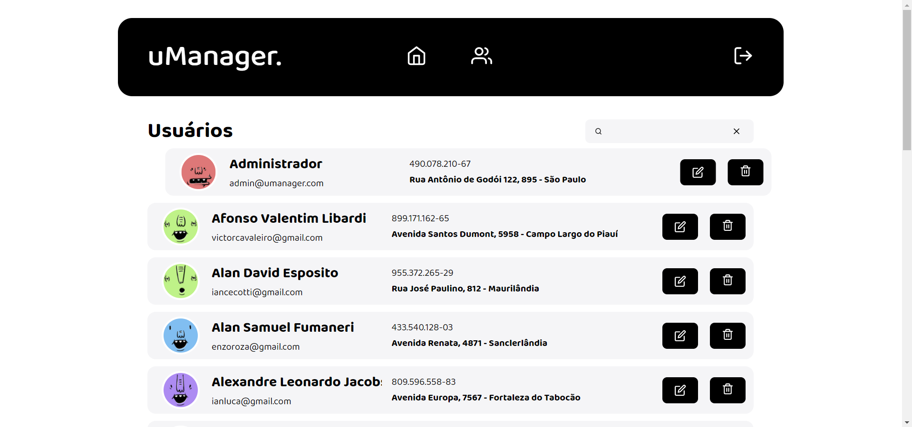

# uManager.

> An Application to create, list, edit and delete users.



## :computer: How Run

1 - Clone repository

```
git clone https://github.com/AdrielGarciaS/umanager.git

cd umanager

yarn
```

2 - Run server

```
yarn server
```

3 - Run application

```
yarn start
```

4 - Enjoy

Did by Adriel with :heart:
